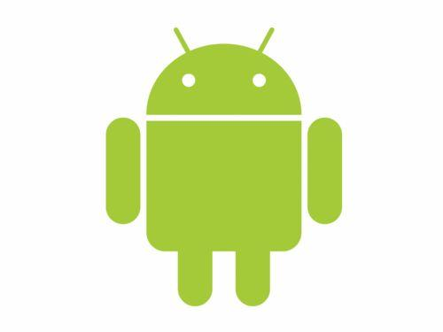

# 第一次使用github

## 这里是导航栏部分的代码

##### HTML部分

```html
<div class="allthing">
			<h1>我们第一个github网页</h1>
			<div id="top">
				<div class="introuduce">
					<div class="name_top">
						<div>
							<a href="top.html"  target="in_item">首页</a>
						</div>
					</div>
					<div class="name_top">
						<div>
							<a href="introduce By FuYuchen.html" target="in_item">付禹辰</a>
						</div>
					</div>
					<div class="name_top">
						<div>
							<a>
							包宸嘉
							</a>
						</div>
					</div>
				</div>
				
				<div id="body">
					<iframe src="introduce By FuYuchen.html" name="in_item"></iframe>
				</div>
			</div>
			<div class="bottom">
			<a href="demo1.html" target="in_item" >.</a>
			</div>
		</div>
		
```

##### css部分

``` css
	*{
				margin: 0;
				padding: 0;
			}
			.allthing{
				width: 100%;
				max-width: 1400px;
				height: 100%;
				margin: 0 auto;
			}
			body,html{
				height: 100%;
				justify-items: center;
			}
			h1:first-of-type{
				text-align: center;
				background-color: gainsboro;
				height: 2em;
				line-height: 2em;
				border: 2px solid black;
				max-width: 1600px;
				box-sizing: border-box;
			}
			#top{
				height: 60%;
				max-width: 1600px;
				display: flex;
				align-items: center;
			}
			.introuduce{
				width: 30%;
				height: 100%;
				background-color: ghostwhite;
				border: 2px solid black;
				max-width: 250px;
			}
			.name_top{
				height: 10%;
				text-align: center;
				font-size: 18px;
				background-color: gray;
				display: flex;
				align-items: center;
				justify-content: center;
				border-width: 1px 0px;
				border-color: green;
				border-style: solid;
				box-sizing: border-box;
			}
			#body{
				width: 100%;
				height: 100%;
			}
			
			iframe{
				height: 100%;
				width: 100%;
				right: 0;
				border: 2px solid black;
				box-sizing: border-box;
			}
			a:visited{
				color: black;
			}
			a{
				text-decoration: none;
				color: black;
			}
			.name_top:hover{
				cursor: pointer;
				border: 1px red solid;
			}
			.name_top div,.name_top div a{
				width: 100%;
				height: 100%;
				display: flex;
				align-items: center;
				justify-content: center;
			}
			.bottom{
				min-height: 25%;
				max-height: 30%;
				width: 100%;
				border: 4px solid black;
				background:url(img/rssmozx6.bmp) repeat-x;
				max-width: 1600px;
				box-sizing: border-box;
			}
```

## 这是我的自我介绍部分的代码

HTML部分

```html
<div class="all">
			<div class="head">
				付禹辰
			</div>
			<div class="body">
				<ul>
					<li>性别：男</li>
					<li>爱好：看高科技产品 </li>
					<li>兴趣：写程序</li>
					<li>理想：进入华为,成为鸿蒙开发工程师，进入管理层</li>
				</ul>
			</div>
		</div>
```

css部分

```css

			.head{
				text-align: center;
				font-size: 35px;
				font-family: "黑体";
				font-weight: bold;
			}
			.body{
				text-indent: 2em;
				background: url(https://bkimg.cdn.bcebos.com/pic/267f9e2f070828381f30af7d02d0be014c086e065b0a?x-bce-process=image/watermark,image_d2F0ZXIvYmFpa2UyNzI=,g_7,xp_5,yp_5/format,f_auto)
				no-repeat  right bottom;
			}
			ul{
				list-style: none;
				font-size: 18px;
			}
			.all{
				max-width: 600px;
				max-height: 600px;
			}
			.head{
				margin: 0 auto;
			}
```

#### 首页

HTML部分

<h2>这是我和包宸嘉的一起合作的第一个网页</h2>

```html
	<div class="body">
		<br />
		
	</div>
```
css部分

``` css
*{
			margin: 0;
			padding: 0;
			}
			.body{
				max-width: 490px;
				max-height: 470px;
				display: flex;
				flex-direction: column;
			h2{
				text-align: center;
				height: 2rem;
			}
			header{
				display: flex;
				justify-content: center;
			}
			img{
				width: 50%;
				height: 50%;
				max-width: 300px;
				max-height: 300px;
				justify-content: center;
			}
```


> 感谢包宸嘉为后续完整版的导航网页提供样式设计支持

ps:~~其实不感谢也无所谓~~

~~我还在里面藏了一个彩蛋~~

****

**总之第一次使用还请多多指教**

*加油*


